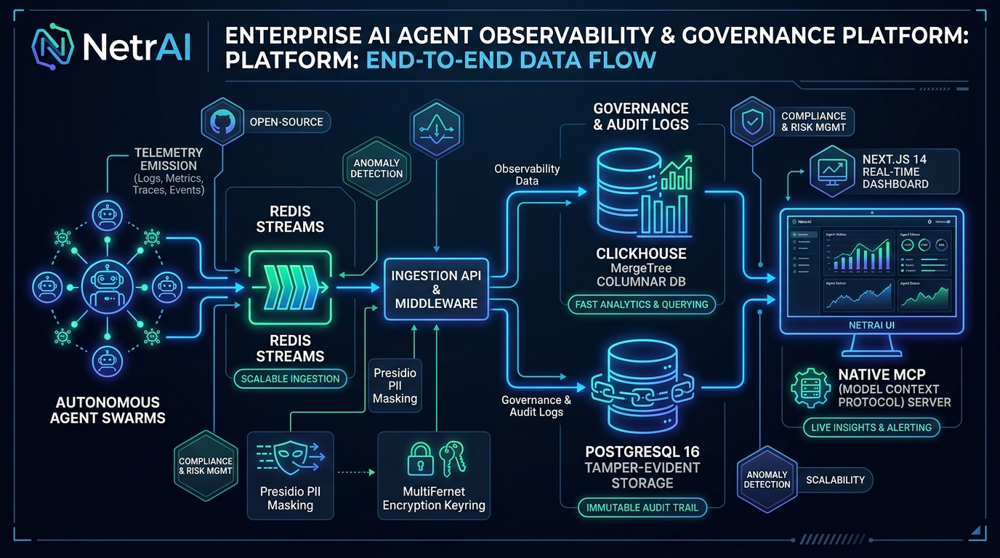
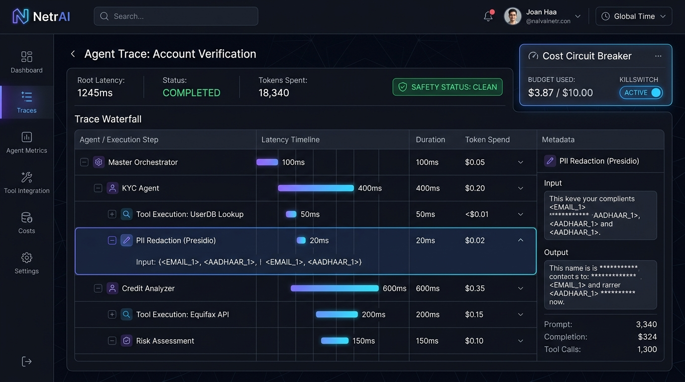

# NetrAI (netrai)

<div align="center">



**Open-Source Multi-Agent Observability, Security & Governance Platform**

[](https://agentwatch-19dt.vercel.app/)

<br />

[](LICENSE)
[](https://www.python.org/downloads/)
[](https://nextjs.org/)
[](https://clickhouse.com/)
[](https://www.postgresql.org/)
[](https://redis.io/)
[](docs/dpdp-deployment.md)

🌐 **Live Application URL**: [https://agentwatch-19dt.vercel.app](https://agentwatch-19dt.vercel.app)

</div>

---

## 🚀 Overview

**NetrAI** is an enterprise-grade observability and governance engine designed specifically for autonomous multi-agent swarms (LangChain, AutoGen, CrewAI, OpenAI Assistants, Claude Swarms). It traps infinite tool loops with real-time cost circuit breakers, blocks adversarial prompt injections, reversibly sanitizes PII with Presidio and MultiFernet key rotation, and provides live native Model Context Protocol (MCP) telemetry.

---

## 📸 Platform Architecture & UI

### 1. End-to-End Ingestion Pipeline & Architecture
Autonomous agent swarms emit OpenTelemetry-compatible traces via Redis Streams into the high-throughput Ingestion API. Sensitive PII (Emails, Aadhaar, PAN, API keys) is tokenized with Presidio and encrypted into PostgreSQL using a rotating Fernet keyring (`MultiFernet`), while high-cardinality telemetry persists to ClickHouse 24.8 MergeTree.


---

### 2. Multi-Agent Trace Waterfall & Cost Circuit Breakers
Inspect hierarchical agent executions (parent agent $\rightarrow$ sub-agents $\rightarrow$ tools) with millisecond latency breakdowns, token spend tracking, and automatic loop killswitches that sever runaway agent cycles before they cause thousands of dollars in surprise API bills.



---

## 📦 Services

- `sdk-python` — Python client for emitting OpenTelemetry-compatible spans and agent topology events.
- `ingestion-api` — FastAPI endpoint that validates, sanitizes, and publishes spans to Redis Streams.
- `worker` — High-throughput Redis Streams consumer that persists sanitized spans to ClickHouse and encrypted PII tokens to PostgreSQL.
- `dashboard` — Next.js 14 App Router dashboard with live trace waterfalls, eval metrics, and SuperAdmin tenant management.
- `infra` — Local ClickHouse, PostgreSQL, and Redis container definitions.

---

## 🛠️ Local Infrastructure Setup

Bring up the complete data cluster with Docker Compose:

```bash
docker compose -f infra/docker-compose.yml up -d
```

See [`docs/schema.md`](docs/schema.md) for canonical event schemas and database DDL.

---

## 💻 Develop without Docker

The ingestion API can run with an in-memory span store while Docker is unavailable:

```powershell
cd ingestion-api
py -m venv .venv
.\.venv\Scripts\Activate.ps1
pip install -r requirements.txt
$env:SPAN_BACKEND = "memory"
uvicorn app.main:app --reload
```

Interactive OpenAPI docs will be available at `http://127.0.0.1:8000/docs`.

Run the Next.js 14 dashboard separately:

```powershell
cd dashboard
npm install
npm run dev
```

---

## 🐍 Python SDK Quickstart

Install locally with `pip install -e ./sdk-python`. Configure `AGENTWATCH_API_KEY`, `AGENTWATCH_ENDPOINT`, and trace agent hierarchies:

```python
from agentwatch import trace_agent, trace_llm, trace_tool

@trace_llm()
def ask_model():
    return client.chat.completions.create(model="gpt-4.1-mini", messages=[...])

@trace_tool()
def search(query):
    return index.search(query)

with trace_agent("research_pipeline", agent_id="researcher_01"):
    search("quarterly earnings")
    ask_model()
```

---

## 🔐 PII Masking & Cryptographic Key Rotation

Configure shared encryption keys via `PII_FERNET_KEYS` (or legacy `PII_FERNET_KEY`):

```bash
python -c "from cryptography.fernet import Fernet; print(Fernet.generate_key().decode())"
```

The worker replaces detected PII in `input` and `output` with tokens before ClickHouse insertion and stores only encrypted token mappings in Postgres.

> [!IMPORTANT]
> `PII_FERNET_KEYS` supports a comma-separated key ring (`PII_FERNET_KEYS="<new_key>,<old_key>"`) implementing `cryptography.fernet.MultiFernet`. The **first key** is used for all new encryptions, while **all keys** are attempted in order for unmasking and decryption.
>
> `PII_FERNET_KEYS` **must be identical** across both the `worker` and `ingestion-api` services, and stored in a secure secrets manager for production deployments. See [Key Rotation Guide](docs/key-rotation.md) for zero-downtime rotation instructions.

API keys have an `ingest` scope by default. Grant `unmask` explicitly only to audited, trusted keys. `POST /v1/spans/{span_id}/unmask` returns authorized token replacements and records an immutable audit entry.

---

## 🧪 End-to-End Testing

Run the full end-to-end integration test against live Docker instances of Postgres, ClickHouse, Redis, Ingestion API, and Worker:

```bash
# 1. Bring up the test cluster with layered compose
docker compose -f docker-compose.test.yml up -d --build --wait

# 2. Run the E2E pytest suite
pytest e2e/ -v

# 3. Teardown test cluster
docker compose -f docker-compose.test.yml down -v
```

The test suite validates:
1. Healthcheck synchronization across all services (`/healthz`, Postgres, ClickHouse, Redis).
2. Trace submission containing personal data (Email, Indian Aadhaar).
3. Verification that ClickHouse stores masked tokens with zero raw PII leakage.
4. Token unmasking via `POST /v1/spans/{span_id}/unmask` with `MultiFernet`.
5. Immutable audit entry generation in PostgreSQL `audit_log`.

---

## 🛡️ License

Apache License 2.0. See [LICENSE](LICENSE) for details.
